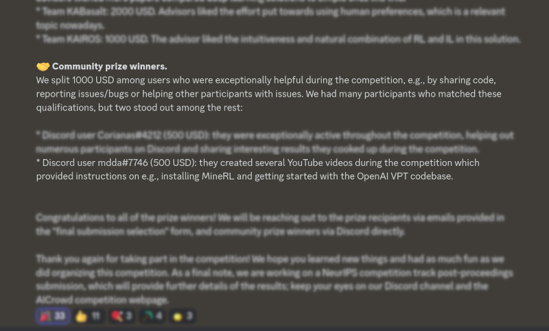

# DiamondJAX
`
#minecraft,#MineRL,#machinelearning,#deeplearning,#openai,#googlecolab,#jax,#pytorch
`

Repository of useful stuff for the MineRL BASALT Challenge.

### News!

Super proud to have won a Community Award from the BASALT/MineRL community for making these videos and code samples!

Here's a screenshot from their announcement on discord:

### Episode 1 (2022-06-28) : First steps with MineRL &rarr; [YouTube Video](https://youtu.be/8yIrWcyWGek)

* This episode's Colab Notebook : [DiamondJAX_00-SetUp](https://colab.research.google.com/drive/1rJ3lGy-bG7kJRe_wYBWg7fjSaD9oOMDw?usp=sharing)
* [Additional links](./2022-06-28_MineRL-01/)

### Episode 2 (2022-07-06) : OpenAI VPT for YouTube Videos &rarr; [YouTube Video](https://youtu.be/qdITG9B9s3c)

* This episode's Colab Notebook : [DiamondJAX_02-VPT-on-YouTube](https://colab.research.google.com/drive/17FiaBr8hqaHrfac4b-NUi3giF1qB--4g?usp=sharing)
* [Additional code and links](./2022-07-02_MineRL-02/)

### Episode 3 (2022-07-12) : OpenAI VPT for Android Demos &rarr; [YouTube Video](https://youtu.be/S9sAd3DqToE)

* This episode's Colab Notebook : [DiamondJAX_03-VPT-for-AndroidDemos](https://colab.research.google.com/drive/1tUR0Y7fpxF3O_bLfiks6imSzNXJ_BRvK?usp=sharing)
* [Additional code, data and links](./2022-07-12_MineRL-03/)

### Episode 4 (2022-09-14) : Installing MineRL using Containers &rarr; [YouTube Video](https://youtu.be/ZkoU9pRyS38)

* This episode's [Blog post](https://blog.mdda.net/ai/2022/09/13/running-minerl-within-a-container)
  + Includes the code, etc
* [Additional links](./2022-09-14_MineRL-04/)

* **Please let me know if there are Windows resources I should add ...**

## License

This Repo is MIT-licensed (attribution required).

